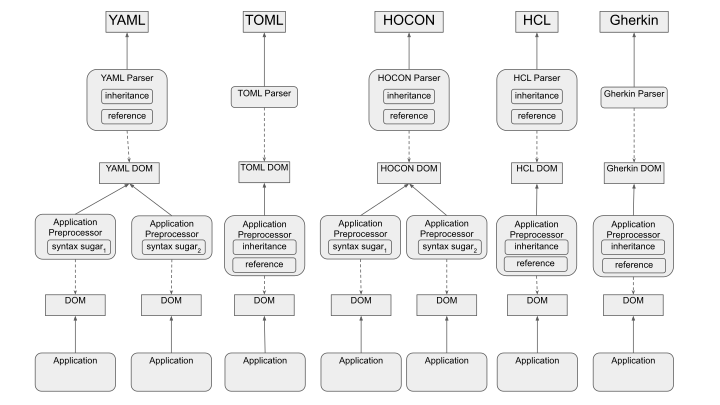
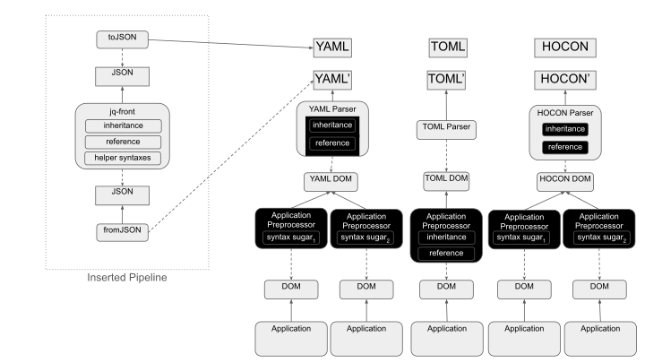
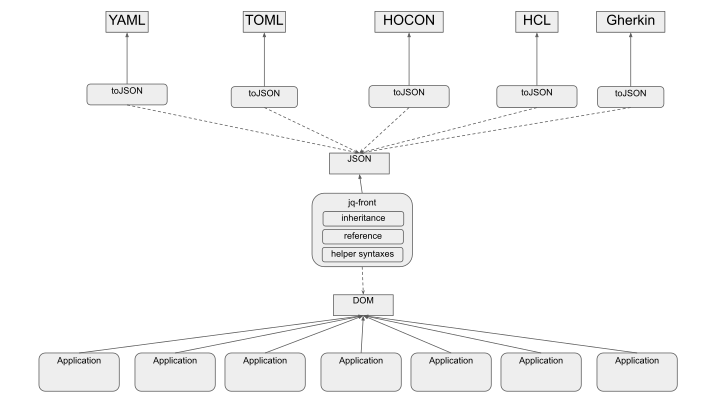

// suppress inspection "GrazieInspection" for whole file
:toc:

= JSON++ is All You Need

**Abstract:** In various areas of software development, to describe information with complex structures and constraints, a number of similar but different notations have been proposed and used.
This is especially frequent in configurations of distributed systems.
In this article, we strictly identify a notation's human-readability and functionality are different ones.
Then, we introduce a notation which focuses on the latter, called **JSON{plus}{plus}**.
Based on it, we demonstrate a pipeline-based approach is possible, where data defined in human-readability focused notations such as **YAML** and **HCL** are transformed into **JSON{plus}{plus}**.
Finally, it will be shown that such DRY features can be expressed by **JSON{plus}{plus}** syntax in a uniformed way, which reduces learning cost for users and allows for developers to focus on human-readability of the notations.

[[introduction]]
== Introduction

**Status Quo:** Not a few similar yet different notations have been proposed and applied to various software products to describe information with complex structures and constraints.

This is a situation found especially frequent in configuration files of distributed systems backed by containerized virtualization solutions.
There are tools to manage instances under **docker**<<docker>>, **Kubernetes**<<k8s>>.
Most of them use **YAML**<<kustomize>><<helm>><<docker-compose>>, but **Terraform**<<terraform>> uses its own notation; **HCL**.
Not only that, in testing, **runn** uses YAML<<yaml>>, while **Cucumber**<<cucumber>> uses **Gherkin**<<gherkin>>.
Another notation is **TOML**, which is used for building python projects<<pyproject>>, configuring blog system<<hugo>>, etc.

In short, currently, various applications use various notations to define their own DSLs for configurations and tests.
However, they share common concerns and keep addressing similar problems repetitively, which is inefficient, error-prone, and raising learning costs for users.

**Proposed Method:** In this article, we will propose a method, where:

1. We consider human-readability and conciseness are completely separate concerns.
"Conciseness" here means the ability to describe structured information without redundancy under a given grammarfootnote:humanReadability[Verboseness of the grammar should be addressed as a part of human-readability and achieved by the design of the grammar.].
2. Then, we will focus on the concise and propose a notation **JSON{plus}{plus}**.
This will be a notation whose instances are strictly complying with JSON.
3. After that, we will propose a pipelined approach, whose first stage converts human-readable input files into JSON files.
The pipeline will then process the **JSON** files as **JSON{plus}{plus}** files and resolve inheritances and interpolations defined in them.

**Evaluation and Results:** In the <<results>> section, we will show case-study results, where the method is applied to a few real-world examples, such as **TOML** used in `pyproject.toml`, tests written in **Gherkin** and **YAML**,

This approach allows us to keep using the already existing tool supports,
such as syntax highlighting plugins, refactoring feature of editors, CLI tools to manipulate the data, and other utilities.
For application developers, it is also beneficial because burdens to simplify their configuration notations will be removed.
Because it will be a user side concern.
Only in case they want to uniform how such configurations should be written, or they want to reduce user side effort, they can bundle **JSON{plus}{plus}** files which define reasonable default values with their product.

The rest of this paper is organized as follows:
In <<background>>, we will discuss how the problem of repetitiveness in configuration files and other sorts of files has been addressed, or not addressed.
In <<technique>>, the details of our approach and the syntax we designed for this approach will be described.
Then in <<results>>, we look into how much the approach can reduce the size of configuration files by applying it to an actual example.
In the <<conclusion>>, we will summarize our findings and future works.

[[background]]
== Background

In software industry, although it is considered important practice to follow the "D-R-Y" (Don't repeat yourself) principle<<dry>>, configuration files and other data files sometimes become repetitive and hard to maintain.
For example, to configure a distributed system, to define test cases, or to define characters and stages for a game, we need to describe similar yet slightly different files over and over again.

For applications developed in those areas, various notations have been developed and used.
Such as **YAML**, **TOML**, **HOCON**, **HCL**, **Gherkin**, etc.

In order to mitigate the redundant descriptions, some of them have features to define information using concepts of inheritances and references.
Not only that, some software products avoid this situation by introducing their own syntax sugars to their configuration file specifications.

Figure <<figure.statusQuo>> shows this situation as a model.

[[figure.statusQuo, 1.]]
.Status Quo

Each notation may have inheritances and references as its own features.
Not only that, each application may have inheritances and node references as its feature to help its users.
On top of that, they may have syntax sugars if the designer thinks it's necessary to help their users.

This creates following challenges in the industry.

* Application developers need to implement common features such as inheritances and reference resolutions for each product every time.
* The same feature is implemented using different syntaxes of the host notation, or a syntax the application defines.
This increases learning costs of application specifications.
* Semantics of the same feature can be subtly different, which will sometimes result in expensive costs.
For instance, multiple inheritance is necessary to reduce redundancy in configuration files.
However, is it implemented using depth first search or width first search?
This can create a discrepancy in users/operators mind about a product's expected behaviors.

|===
| Feature| YAML| TOML| HOCON| HCL| Gherkin| XML

| **Single Inheritance**
| ✔️ (using anchors/aliases)
| ❌ (no direct support)
| ✔️ (using object merging)
| ✔️ (using modules)
| ❌ (no direct support)
| ⚠️ (using DTD or XSD, limited)

| **Multiple Inheritance**
| ⚠️ (with merge arrays but limited)
| ❌ (no direct support)
| ✔️ (using fallbacks/merging)
| ❌ (no direct support.
It can be simulated by combining modules) | ❌ (no direct support) | ❌ (no direct support)

| **Nested Inheritance**       | ✔️ (with layered anchors)   | ❌ (no direct support)      | ✔️ (layered object merging) | ⚠️ (limited support via module chaining) | ❌ (no direct support) | ⚠️ (using nested elements, limited)

| **Node References**          | ✔️ (anchors/aliases for references) | ❌ (no direct support)      | ✔️ (substitution with `${}` syntax) | ✔️ (expressions and variable references) | ❌ (no direct support) | ⚠️ (using XPointer or XPath, limited)

| **Limitations of Multiple Inheritance** | Limited by merge key order; complex configurations can become difficult to read | Not supported natively; manual repetition required | Supported but can be complex in deeply nested structures | Not directly supported; combining modules is complex | Not supported; only supports simple statements | Not supported; merging different schemas requires external processing

| **Relationship with JSON**   | ✔️ (YAML is a superset)     | ❌ (not a superset)         | ✔️ (HOCON is a superset)    | ❌ (not a superset)           | ❌ (not a superset)        | ❌ (not a superset, but can be converted)

| **Tool to Convert to JSON**  | PyYAML, js-yaml (JavaScript) | TomlKit, toml (Python)     | Lightbend Config (Scala/Java), pyhocon (Python) | hcl2json (Go)                | Cucumber (with JSON formatter) | xmltodict (Python), xml2js (JavaScript)
|===

From this matrix, you may think that **HOCON** provides all the necessary functionalities.
However, it still has the following challenges in practice.

* **HOCON** is a much less popular notation than **YAML**.
* It doesn't allow to define a function so that a formula to compute a node value can be reused.
* It is

Thus, we can state that there is no good solution to this problem.

[[technique]]
== Technique

As stated in the **Background** section, the industry has tried to address similar problems over and over again.
One uses YAML, another TOML, yet another comes up with a new notation such as HCL, HOCON, etc.
To address these challenges, we have created a tool called **jq-front**<<jq-front>>.

=== Separation of Concerns

In our approach, we identify the human readability and the capability to make the descriptions "D-R-Y"ed are completely independent concerns.
Being able to reduce repetitions might improve the human-readability as a result as a result, still it is different from the readability improvement delivered by YAML,TOML, HCL, and other sorts of super-JSON notations.
Those notations allow users not to quote strings, where obvious from the context.

=== New Notation: JSON{plus}{plus}

Through examining various notations, authors realized that the functionalities designed and implemented over and over again at the every corner of the industry are essentially:

* Inheritances
* Interpolations

Also, all those notations, such as **YAML**, **TOML**, **HOCON**, **HCL**, are designed to be "superset" of **JSON**.
Also, tools to convert them into **JSON** are available.

*JSON{plus}{plus}* is a notation to implement the features but within the syntax of **JSON** by introducing a few keywords that have special semantics.

As it is designed to bestrictly compliant with **JSON**, we do not need to re-implement tools to edit or manipulate it.
We can just reuse such tools developed for **JSON**.
Applications will not need to develop its own custom configuration format.
They will just choose one of preferred formats from **YAML**, **TOML**, etc. and define built-in files to ease user's effort.

=== JSON++ processor: jq-front

We implemented a processor **jq-front**<<jq-front>>, that converts data written in JSON{plus}{plus} into plain JSON.
We named this tool after a pre-processor that converts C{plus}{plus} source code into plain C source code, **Cfront**<<Cfront>>.

[ditaa]
----
                                         +-----------------------------+
        +----------+                     |                             |
        |  Input{d}|<--------------------+  Inheritance Resolver Module|
        +----------+                     |                             |
                                         +---------------+-------------+
                                                         |
                                                         :
                                                         V
                                                    +----+----+
                                                    |Work(2 a)|
                                                    |{d}      |
                                                    +----+----+
                                                         ^
                                                         |
                                              +----------+---------+
                                              |    Interpolation   |
                                              |   Handling Module  |
                                              +----------+---------+
  +----+       +----+                                    |
  |A{o}+-=---->+B{o}| (A writes to B)                    :
  +----+       +----+                                    V
                                                     +---+---+
  +----+       +----+                                |Output |
  |A{o}+------>+B{o}| (A reads from B)               |{d}    |
  +----+       +----+                                +---+---+
----

It consists of a couple of moules, which are **Inheritance Resolution** and **Interpolation Handling**.
As their names suggest, once a source file is given to the tool, **Inheritance Resolution** module processes it to resolve inheritances defined in the source.
Then its output is passed to the **Interpolation Handling** module.
Each of them has its own internal pipelines.
In this section, we will be looking into them one by one.

For the sake of the discussion, we assume we have the following files in the current working directory.

[source,json]
.source.json++
----
{
  "$extends": [ "base.json++" ],
  "$local": {
    "A": {
      "eval:$(echo -n Hello)": "eval:string:$(ref .test.k)"
    }
  },
  "test": {
    "$extends": [
      "A"
    ],
    "k": "hello"
  }
}
----

[source,json]
.base.json++
----
{
  "base": "world"
}
----

==== Inheritance Mechanism

**Inheritance Resolution** is divided into three parts as in all.
One is "file level inheritance handling", another is "local node materialization", and the third is "node level inheritance".
Each of them is designed to serve for different responsibilities.

[[inheritance]]
[ditaa]
.Inheritance Mechanism
----
              +------------------------------------------------------------------------+
              |                                                                        |
              | file-level                    local node materialization               |
              | inheritance                                                            |
              |   +----+                               +-----+                         |
    +---------|---+ {o}+-=----------+     +------------+ {o} +-=-----------+           |
    |         |   +----+            |     |            +-----+             | 0...n     |
    V         |                     V     V                                V           |
  +------+    |                    +-------+                         +------------+    |
  |Source|    |                    |Work(1)|                         |LocalNodes  |    |
  |{d}   |    |                    |{d}    |                         |{d}         |    |
  +------+    |                    +-------+                         +------------+    |
              |                        ^        node-level inheritance     ^           |
              |                        |              +-----+              |           |
              |                        +--------------+ {o} +--------------+           |
              |                                       +--+--+                          |
              |                                          |                             |
              +------------------------------------------|-----------------------------+
  +----+       +----+                                    |
  |A{o}+-=---->+B{o}| (A writes to B)                    :
  +----+       +----+                                    V
                                                     +---+---+
  +----+       +----+                                |Output |
  |A{o}+------>+B{o}| (A reads from B)               |{d}    |
  +----+       +----+                                +---+---+
----

In this working example, only one file is specified in the `$extends` directive.
When more than one files are specified, and they are extending other files, the inheritance resolution will happen in a manner of "width-first" way.

File Level Inheritance:: In the file level inheritance resolution, it reads a given source file, and it traces the files on `JF_PATH` environment variable.
Through this process, a file **Work (1)** in the Figure <<inheritance>>, will be generated and its content will be as follows.

[source,json]
.Content of a temporary file: "Work (1)"
----
{
  "$local": {
    "A": {
      "eval:$(echo -n Key)": "eval:string:$(ref .test.k)"
    }
  },
  "test": {
    "$extends": [
      "A"
    ],
    "k": "hello"
  },
  "base": "world"
}
----

Local Node Materialization:: A "local node" is a concept to use "inheritances" without creating files outside a source file.
In the given source file, there is a node `$local`, under which an entry `"A": { "key": "..." }` is defined.
This generates a file whose name is `A` under a temporary directory, which is a part of `JF_PATH` environment variable.
Thus, exactly the same syntax and behavior is available, when a data designer places `$extends: ["A"]` somewhere in the source file.

[source,json]
.The content of file "A"
----
{
  "eval:$(echo -n Key)": "eval:string:$(ref .test.k)"
}
----

`ref` is a built-in function of the processor, and it prints a value of a node specified by an argument passed to it.

Node Level Inheritance:: A node `.test` has `$extends` directive in it.
Its value is an array whose only element is `A`.
It extends the content of `A`, whose content was seen earlier in this section.
After this inheritance is processed, the output of this step (Work (2 a)) will look like as follows.

[source,json]
.Content of a temporary file: "Work (2 a)"
----
{
  "test": {
    "eval:$(echo -n Key)": "eval:string:$(ref .test.k)",
    "k": "hello"
  },
  "base": "world"
}
----

=== Interpolation Mechanism

After inheritances are processed, "interpolation" mechanism will be executed.
This stage consists of two steps, which are "key-side" processing and "value-side" processing.

[ditaa]
.Interpolation Mechanism
----
                                                    +----+----+
                                                    |Work(2 a)|
                                                    |{d}      |
                                                    +----+----+
                                                         ^
                                                         |
                                              +----------|---------+templating (optional)
                                              |          |         |
                                              |       +--+--+      |
                                              |       | {o} |      |key-side processing
                                              |       +--+--+      |
                                              |          |         |
                                              |          :         |
                                              |          V         |
                                              |+---------+--------+|
                                              ||    Work(2 b)     ||
                                              ||internal variable ||
                                              |+---------+--------+|
                                              |          ^         |
                                              |          |         |
                                              |          |         |
                                              |       +--+--+      |
                                              |       | {o} |      |value-side processing
                                              |       +--+--+      |
                                              |          :         |
                                              +----------|---------+
  +----+       +----+                                    |
  |A{o}+-=---->+B{o}| (A writes to B)                    :
  +----+       +----+                                    V
                                                     +---+---+
  +----+       +----+                                |Output |
  |A{o}+------>+B{o}| (A reads from B)               |{d}    |
  +----+       +----+                                +---+---+
----

In these steps, string values which start with `eval:` will be replaced with the value computed from the string right next to it.
That is, if you have a string value:

----
"key": "eval:string:$(echo 'Hello') world"
----

The part `string:` specifies the type of the node after interpolation happened.
You can specify one of `string`, `number`, `bool`, `array`, and `object`.
Otherwise, it will be treated as `string`.
The part `$(echo 'Hello')` will be evaluated and embedded at the JSON path, instead of the original string, which will result in footnote:rawKeyword[To "escape" a string starting with `eval:`, you can use `raw:` keyword.
With it, you can describe such a string as:
`"eval:string:$(echo 'Hello') world"`.]:

----
"key": "Hello world"
----

Key-side processing:: As the name suggests, this step processes the keys starting with `eval:`.
After this process is performed, the file will like as follows:

[source,json]
.Content of File: `Work(2 b)`
----
{
  "test": {
    "k": "hello",
    "Hello": "eval:$(ref .test.k)"
  },
  "base": "world"
}
----

Value-side processing:: This step performs the string value interpolation the same as **Key-side processing**, but for values of JSON object.

[source,json]
.Content of Output
----
{
  "test": {
    "k": "hello",
    "Hello": "hello"
  },
  "base": "world"
}
----

=== Pipelined Approach

Conventional approaches in <<background>> section do not identify concerns such as readability for humans and that for machines as independent ones.
Instead, they process configuration files in a monolithic single step Fig. <<monolithic>>.

[[monolithic, 1]]
[mermaid]
.Conventional Monolithic Approach
----
graph LR
    App((Application))    -->|read| AppData[A: Custom Representation]
    App -->|Parse Input, Process Inheritances and Interpolatiopns, and Perform Business Logic| App
----

An application reads configuration files, resolves references and inheritances, and it interprets their contents based on application-specific semantics.
Based on the interpreted information, it performs required operations.
These are executed as a single and indivisible action.

Instead, the approach we are proposing separates these concerns independent and executable one by one.

[[pipelinedApproach, 5.]]
[mermaid]
.Proposed "Pipelined" Approach

In the Figure <<pipelinedApproach>>, it is assumed that the application uses **YAML** or **HCL**, which are supersets of **JSON**.
If the application uses a notation which is not a superset of **JSON**, it needs to be converted back to the original one.

[[results]]
== Results

In this section, we will apply our method to a few existing software products;
**pyproject**, **Cucumber**, and **commandunit**, each of uses **TOML**, **Gherkin**, and **YAML**.

=== `pyproject.toml`

[%collapsible]
====
[source,toml]
----
[tool.poetry]
name = "my_project"
version = "0.1.0"
description = "An example project showing pyproject.toml redundancy"
authors = ["Your Name <you@example.com>"]

[tool.poetry.dependencies]
python = "^3.8"
requests = "^2.25.1"

[tool.poetry.dev-dependencies]
black = "^22.3.0"
isort = "^5.10.1"
mypy = "^0.910"

[build-system]
requires = ["poetry-core>=1.0.0"]
build-backend = "poetry.core.masonry.api"

# Repetition in tool-specific configurations

[tool.black]
line-length = 88
target-version = ['py38']

[tool.isort]
profile = "black"
line_length = 88
known_third_party = ["requests"]

[tool.mypy]
python_version = 3.8
ignore_missing_imports = true

[tool.coverage.run]
branch = true
source = ["my_project"]

[tool.coverage.report]
fail_under = 80
omit = [
    "tests/*",
]

[tool.flake8]
max-line-length = 88
ignore = ["E203", "W503"]
----
====

=== `commandunit`

The tool **commandunit** is designed for integration tests for commandline programs.
It allows users to write tests in given-when-then style using YAML.

[%collapsible]
====
[source,yaml]
----
#file: noinspection YAMLIncompatibleTypes
---
type: NORMAL
description: []
given:
  description:
  - This step should always be executed.
  stdin: []
  shell:
    name: bash
    options:
    - "-eu"
    - "-E"
  source: []
  environmentVariables:
    COMMANDUNIT_DEPENDENCIES_ROOT: _{COMMANDUNIT_BUILTIN_ROOT}
    COMMANDUNIT_BUILTIN_ROOT: _{COMMANDUNIT_DEPENDENCIES_ROOT}x
  cmd: ":"
  args: []
when:
  description: []
  stdin: []
  shell:
    name: bash
    options:
    - "-eu"
    - "-E"
  source:
  - "${COMMANDUNIT_BUILTIN_ROOT}/bud/lib/core.rc"
  - "${SCRIPTS_DIR}/target_lib.rc"
  environmentVariables:
    COMMANDUNIT_DEPENDENCIES_ROOT: _{COMMANDUNIT_BUILTIN_ROOT}
    COMMANDUNIT_BUILTIN_ROOT: _{COMMANDUNIT_DEPENDENCIES_ROOT}
    SCRIPTS_DIR: "${COMMANDUNIT_PROJECT_DIR}/src/main/scripts"
  cmd: cat
  args:
  - "${SCRIPTS_DIR}/hello.txt"
then:
  description: []
  exitCode:
  - EQUAL
  - 0
  stdout:
    present:
    - REGEX:Hello world
    absent: []
  stderr:
    present: []
    absent:
    - REGEX:.+
----
====

However, quite a few elements are repeated, and they should be defined for a test suite, not for individual test cases.
If we extract such items in a separate file, `core/base.json`, the test case will look like as follows:

[source,yaml]
----
#file: noinspection YAMLIncompatibleTypes
---
"$extends":
  - core/base.json
when:
  environmentVariables:
    SCRIPTS_DIR: "${COMMANDUNIT_PROJECT_DIR}/src/main/scripts"
  source:
    - ${COMMANDUNIT_BUILTIN_ROOT}/bud/lib/core.rc
    - ${SCRIPTS_DIR}/target_lib.rc
  cmd: cat
  args:
    - ${SCRIPTS_DIR}/hello.txt
then:
  exitCode:
    - EQUAL
    - 0
  stdout:
    present:
      - REGEX:Hello world
  stderr:
    absent:
      - REGEX:.+
----

Following is the `core/base.json` files that should be shared across test cases in the same test suite.

[%collapsible]
====
[source,json]
.`base/normal.json`
----
{
  "type": "NORMAL",
  "description": [
  ],
  "given": {
    "description": [
      "This step should always be executed."
    ],
    "stdin": [
    ],
    "shell": {
      "name": "bash",
      "options": [
        "-eu",
        "-E"
      ]
    },
    "source": [
    ],
    "environmentVariables": {
      "COMMANDUNIT_DEPENDENCIES_ROOT": "eval:string:${COMMANDUNIT_BUILTIN_ROOT}",
      "COMMANDUNIT_BUILTIN_ROOT": "eval:string:${COMMANDUNIT_DEPENDENCIES_ROOT}x"
    },
    "cmd": ":",
    "args": [
    ]
  },
  "when": {
    "description": [
    ],
    "stdin": [
    ],
    "shell": {
      "name": "bash",
      "options": [
        "-eu",
        "-E"
      ]
    },
    "source": [
    ],
    "environmentVariables": {
      "COMMANDUNIT_DEPENDENCIES_ROOT": "eval:string:_{COMMANDUNIT_BUILTIN_ROOT}",
      "COMMANDUNIT_BUILTIN_ROOT": "eval:string:_{COMMANDUNIT_DEPENDENCIES_ROOT}"
    },
    "cmd": "eval:string:$(error 'missing attribute!')",
    "args": [
    ]
  },
  "then": {
    "description": [
    ],
    "exitCode": [
      "EQUAL",
      0
    ],
    "stdout": {
      "present": [
      ],
      "absent": [
      ]
    },
    "stderr": {
      "present": [
      ],
      "absent": [
      ]
    }
  }
}
----
====

NOTE:: This approach doesn't require IDE support for JSON++ as it is just a subset of JSON.
No intrusion

[[conclusion]]
== Conclusion

."Ideal World" to be delivered by JSON++

=== Limitation

An application sometimes defines its own syntax on top of the notation it uses for configuration.
We expect such a syntax to be simplified and uniformed by applying our approach.
However, this benefit was not examined in this study with existing practical examples.

Multi-key handling::
In case a notation has a feature, which cannot be represented in **JSON**; this approach requires extra treatment.
For example, **YAML** allows to define entries with the same key multiple times, which is not valid in **JSON**.
In such cases, we will need to introduce a convention that interprets it into **JSON**, and converts it back to **YAML**, safely.

=== Future Works

Implementation in faster and more reliable languages such as **Java**, **Golang**, **Rust**, or whatever else is desired.
Sandboxing.

Refining finer details such as semantics on multiple inheritances.
That is, what should happen when different types of nodes are found at the same JSON path location.

[bibliography]
== References

- [[[diagrams, 0]]] https://docs.google.com/presentation/d/1lVF6P2Ypzk11JO3rv1d0s6CmRGbjNJapnJuxtJqVnYo/edit#slide=id.p[diagrams]
- [[[jq-front, 1]]] jq-front project in github.org. https://github.com/dakusui/jq-front[jq-front]:
2019
- [[[Cfront, 2]]] Cfront article in Wiki[edia https://en.wikipedia.org/wiki/Cfront
- [[[dry, 3]]] Hunt, Andrew, Thomas, David (1999).
The Pragmatic Programmer : From Journeyman to Master (the first edition).
US: Addison-Wesley. pp. 320. ISBN 978–0201616224
- [[[hocon, 4]]] HOCON (Human-Optimized Config Object Notation), https://github.com/lightbend/config[HOCON], 2020
- [[[docker, 5]]] docker t.b.d.
- [[[docker-compose, 6]]] docker-compose t.b.d.
- [[[k8s, 7]]] Kubernetes t.b.d.
- [[[yaml, 8]]] https://yaml.org/[YAML]
- [[[terraform, 9]]] Terraform t.b.d.
- [[[helm, 10]]] Helm t.b.d.
- [[[kustomize, 11]]] Kustomize t.b.d.
- [[[runn, 12]]] https://github.com/k1LoW/runn/blob/main/examples/cdp.yml[runn]
- [[[cucumber, 13]]] https://cucumber.io/docs/[cucumber]
- [[[gherkin, 14]]] https://cucumber.io/docs/gherkin/[gherkin]
- [[[toml, 15]]] t.b.d.
- [[[pyproject, 16]]] t.b.d.
- [[[hugo, 17]]] t.b.d.
